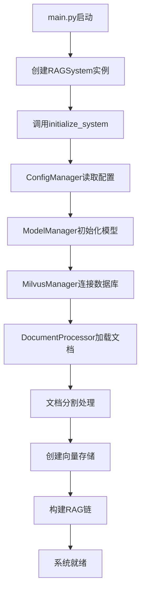
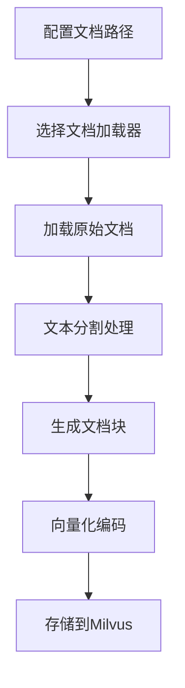

# LangChain RAG 项目文档

## 项目概述

本项目是一个基于LangChain和Milvus的RAG（Retrieval-Augmented Generation）系统，用于构建智能问答系统。系统通过加载文档、分割文本、创建向量存储并使用大语言模型进行问答。

### 主要特性
- **模块化设计**: 清晰的代码结构和职责分离
- **配置驱动**: 支持灵活的配置文件管理
- **多格式文档支持**: 支持TXT、PDF等格式文档
- **现代化架构**: 采用LangChain表达式语言(LCEL)
- **交互式问答**: 提供友好的命令行交互界面

## 项目结构

```
langchain_project/
├── src/                    # 源代码目录
│   ├── __init__.py         # 包初始化文件
│   ├── main.py             # 程序入口点
│   ├── config/             # 配置管理模块
│   │   ├── __init__.py
│   │   └── config_manager.py
│   ├── core/               # 核心模块
│   │   ├── __init__.py
│   │   ├── logger.py       # 日志管理
│   │   └── rag_system.py   # RAG系统主类
│   ├── models/             # 模型管理模块
│   │   ├── __init__.py
│   │   └── model_manager.py
│   ├── vectorstore/        # 向量存储模块
│   │   ├── __init__.py
│   │   └── milvus_manager.py
│   └── documents/          # 文档处理模块
│       ├── __init__.py
│       └── document_processor.py
├── config/                 # 配置文件目录
│   └── config.ini          # 主配置文件
└── README.md               # 项目说明文档
```

## 模块详解

### 1. 配置模块 (config/)

#### config_manager.py
负责读取和管理配置文件，提供各类配置的获取方法。

**主要功能：**
- 配置文件的解析和验证
- 配置项的缓存机制
- 多类型配置支持（字符串、整数、浮点数、布尔值）

**核心类：**
```python
class ConfigManager:
    def __init__(self, config_path: str)
    def get_ollama_config(self) -> Dict[str, Any]
    def get_milvus_config(self) -> Dict[str, Any]
    def get_document_config(self) -> Dict[str, Any]
    def get_qa_config(self) -> Dict[str, Any]
```

### 2. 核心模块 (core/)

#### logger.py
统一日志管理类，提供格式化的日志输出。

**主要功能：**
- 标准化的日志格式
- 多级别日志支持（INFO、WARNING、ERROR）
- 时间戳管理

**核心类：**
```python
class Logger:
    def __init__(self)
    def log_message(self, message: str, level: str = "INFO") -> None
```

#### rag_system.py
RAG系统主类，协调各个模块的工作流程。

**主要功能：**
- 系统初始化管理
- 组件协调调度
- 交互式问答控制
- 资源清理管理

**核心类：**
```python
class RAGSystem:
    def __init__(self, config_path: str)
    def initialize_system(self) -> bool
    def run_interactive_qa(self) -> None
    def cleanup(self) -> None
```

### 3. 模型模块 (models/)

#### model_manager.py
负责Ollama语言模型和嵌入模型的配置与初始化。

**主要功能：**
- 语言模型配置（LLaMA3等）
- 嵌入模型配置（nomic-embed-text等）
- 模型参数管理（温度、基础URL等）

**核心类：**
```python
class ModelManager:
    def __init__(self, logger: Logger, config_manager: ConfigManager)
    def setup_models(self) -> Tuple[Optional[Ollama], Optional[OllamaEmbeddings]]
```

### 4. 向量存储模块 (vectorstore/)

#### milvus_manager.py
管理Milvus数据库连接、集合创建和向量存储操作。

**主要功能：**
- Milvus数据库连接管理
- 向量集合创建和维护
- 多数据库支持检测
- 连接状态监控

**核心类：**
```python
class MilvusManager:
    def __init__(self, logger: Logger, config_manager: ConfigManager)
    def connect(self) -> bool
    def disconnect(self) -> None
    def setup_vector_store(self, embeddings: OllamaEmbeddings) -> MilvusVectorStore
```

### 5. 文档处理模块 (documents/)

#### document_processor.py
负责文档加载、格式化和文本分割。

**主要功能：**
- 多格式文档加载（TXT、PDF）
- 智能文本分割
- 批量文档处理
- 文档内容预览

**核心类：**
```python
class DocumentProcessor:
    def __init__(self, logger: Logger, config_manager: ConfigManager)
    def load_documents(self) -> List[Any]
    def split_documents(self, documents: List[Any]) -> List[Any]
```

### 6. 程序入口 (main.py)
系统启动点，负责初始化RAG系统并运行交互式问答。

**主要流程：**
```python
def main() -> None:
    rag_system = RAGSystem()
    if rag_system.initialize_system():
        rag_system.run_interactive_qa()
    rag_system.cleanup()
```

## 工作流程

### 系统初始化流程


### 问答处理流程


### 文档处理流程


## 配置说明

### 配置文件结构
配置文件位于 `config/config.ini`，采用INI格式：

```ini
[ollama]
llm_model = llama3                    # 语言模型名称
embedding_model = nomic-embed-text    # 嵌入模型名称
base_url = http://127.0.0.1:11434     # Ollama服务地址
temperature = 0.0                     # 生成温度参数

[milvus]
host = 127.0.0.1                      # Milvus主机地址
port = 19530                          # Milvus端口号
collection_name = ragdb               # 向量集合名称
database_name = rag_database          # 数据库名称

[document]
file_paths = /path/to/file1.txt, /path/to/file2.pdf    # 文件路径列表
directory_path = /path/to/documents/                   # 文档目录路径
file_glob = *                                         # 文件匹配模式
exclude_pattern = .temp*                              # 排除文件模式

[qa]
retriever_k = 3                                       # 检索结果数量
prompt_template = 使用以下上下文来回答问题: {context} 问题: {question}    # 提示模板
use_hub_prompt = False                                # 是否使用Hub模板
```

### 配置参数详解

#### Ollama配置段
- `llm_model`: 使用的语言模型名称（如llama3、qwen等）
- `embedding_model`: 文本嵌入模型名称
- `base_url`: Ollama服务的HTTP地址
- `temperature`: 控制生成随机性的参数（0.0-1.0）

#### Milvus配置段
- `host`: Milvus数据库服务器地址
- `port`: Milvus数据库服务端口
- `collection_name`: 向量数据存储的集合名称
- `database_name`: 使用的数据库名称（支持多数据库版本）

#### Document配置段
- `file_paths`: 逗号分隔的具体文件路径列表
- `directory_path`: 文档目录路径，用于批量加载
- `file_glob`: 文件匹配模式（如"*.txt"、"*.pdf"）
- `exclude_pattern`: 排除文件模式

#### QA配置段
- `retriever_k`: 每次检索返回的相似文档数量
- `prompt_template`: 问答提示模板，支持{context}和{question}占位符
- `use_hub_prompt`: 是否使用LangChain Hub中的预定义模板

## 部署和运行

### 环境要求
- Python 3.8+
- Ollama服务（运行在11434端口）
- Milvus数据库（运行在19530端口）

### 安装依赖
```bash
pip install langchain-community langchain-milvus pymilvus
```

### 启动系统
```bash
cd src
python main.py
```

### 交互式使用
```
欢迎使用AI助手！输入 'exit' 退出程序。

问题：什么是机器学习？
AI助手：机器学习是...
--------------------------------------------------
```

## 扩展和定制

### 添加新的文档加载器
在`document_processor.py`中扩展`load_documents`方法，支持新的文件格式。

### 自定义提示模板
修改配置文件中`[qa]`段的`prompt_template`参数，或设置`use_hub_prompt = True`使用Hub模板。

### 调整检索参数
通过修改`retriever_k`参数控制检索结果数量，或扩展`MilvusManager`支持更复杂的检索策略。

## 故障排除

### 常见问题
1. **配置错误**: 检查配置文件路径和格式
2. **服务连接失败**: 验证Ollama和Milvus服务状态
3. **文档加载失败**: 检查文件路径和权限设置
4. **内存不足**: 调整文档分块大小参数

### 日志调试
启用DEBUG级别日志查看更多详细信息：
```python
logging.basicConfig(level=logging.DEBUG)
```